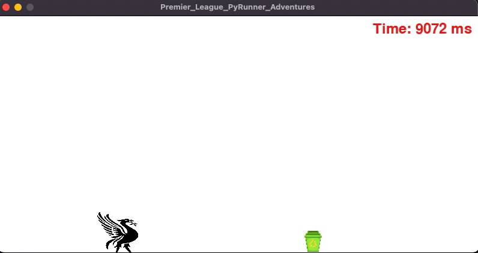

# Premier_League_PyRunner_Adventures

# Runner Game
This is a simple endless runner game implemented in Python using the Pygame library. The player controls a character that can jump to avoid obstacles, and the goal is to survive as long as possible while collecting points.

# How to Play
Run the script to start the game.
In the main menu, use the UP and DOWN arrow keys to navigate the options ("New Game" or "End Game").
Press the RETURN key to select the desired option.
If you choose "New Game," you'll be prompted to select a character. Use the LEFT and RIGHT arrow keys to cycle through available characters and press RETURN to confirm your selection.
The game will start, and you can make the character jump by pressing the SPACE key.
Avoid obstacles and survive as long as possible. Your score is based on the time you stay alive.
When the game is over, you'll see a "Game Over" screen with your elapsed time. Press RETURN to return to the main menu.

# Game Components
Player: The character controlled by the player. It can jump to avoid obstacles.
Obstacles: Pipes that move from right to left. Colliding with an obstacle ends the game.
StartMenu: The main menu allowing the player to start a new game or end the current one.
GameOver: Displayed when the game ends, showing the final time and allowing the player to return to the main menu.
Game: The main game loop, handling player input, updating game elements, and managing collisions.
Customization
Character Selection: You can add or replace character images in the "Jumpers" folder. The game will display available characters during the character selection phase.
Background and Obstacle Images: Replace "background.png" and "pipe.png" with your images for a customized look.

# Requirements
Python 3.x
Pygame library (install using pip install pygame)
Note: The leaderboard functionality has been removed based on user request, and the README reflects the updated description of the game.

# Screenshots 

